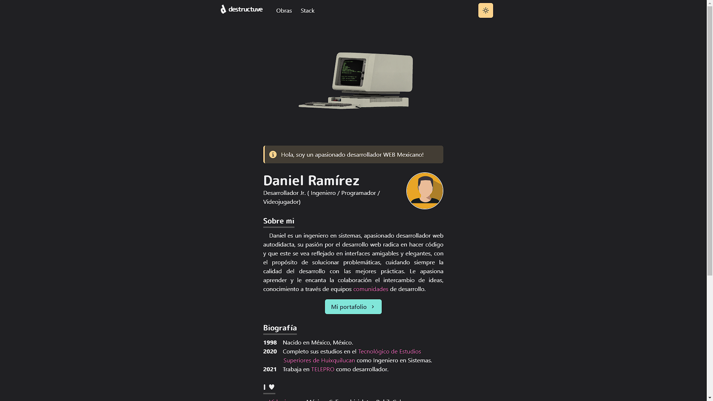

# Mi portafolio 

[Web site](https://portafolio-destructive.vercel.app/)



## Construido con 🛠️
- [Next.js](https://nextjs.org/) - A React framework with hybrid static & server rendering, and route pre-fetching, etc.
- [Chakra UI](https://chakra-ui.com/) - A simple, modular and accessible component library for React
- [Three.js](https://threejs.org/) - 3D library for JavaScript
- [Framer Motion](https://www.framer.com/motion/) - An animation library for React

### Instalación 🔧

_Clonar el repositorio_
```
git clone https://github.com/destructiv33/portafolio.git
```
```
npm install
```
```
npm run dev
```
En tu navegador ir a [http://localhost:3000/](http://localhost:3000//)

### Inspirado en 💡
[Takuya Matsuyama](https://twitter.com/inkdrop_app)
